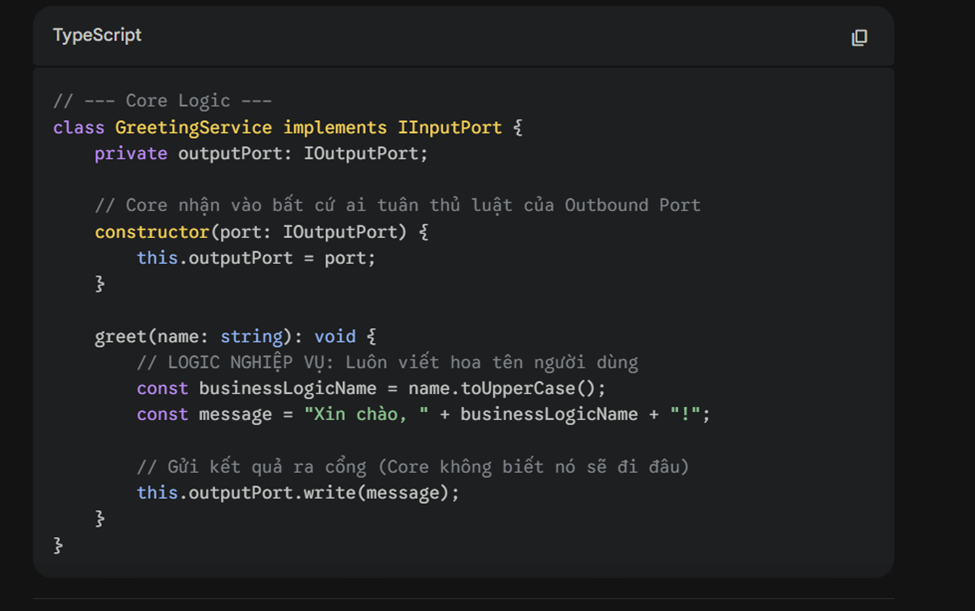
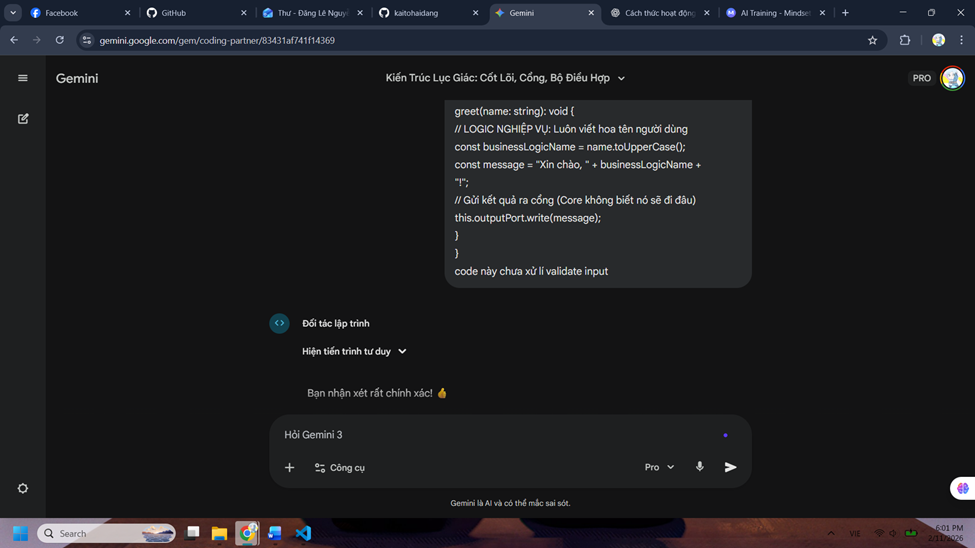
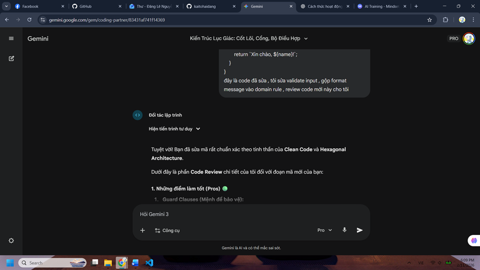
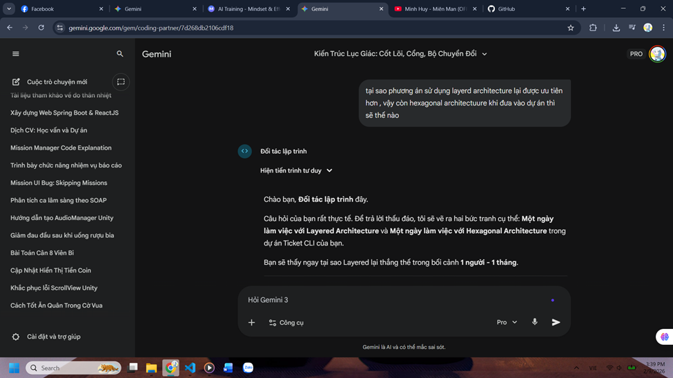

# BÁO CÁO NGHIÊN CỨU TUẦN 1: HEXAGONAL ARCHITECTURE

## 1. Khái niệm và Nguyên tắc cốt lõi
**Khái niệm:** Hexagonal Architecture là mô hình thiết kế phần mềm nhằm tách biệt logic cốt lõi của ứng dụng khỏi các yếu tố bên ngoài như database, ui, hoặc api bên thứ ba.

**Quy trình hoạt động**  

1.  Yêu cầu từ bên ngoài gửi qua Primary Adapters.Adapter chuyển dữ liệu thành đối tượng Domain và gọi hàm trong Input Ports.
2.  Core nhận yêu cầu và xử lý logic nghiệp vụ hoàn toàn cô lập.
3.  Để lưu dữ liệu, Core gọi hàm của Output Ports. Secondary Adapter sẽ thực hiện lưu vào Database hoặc gọi dịch vụ thực tế.

## 2. Các thành phần chính của kiến trúc 

### 2.1. The Core  
* Chứa các  Domain Entities và Service xử lý các luồng nghiệp vụ mà không phụ thuộc vào framework.

### 2.2. Ports  
* Là các **Interface** giúp Core giao tiếp với bên ngoài .
* **Input Ports:** định nghĩa những gì lõi có thể thực hiện .
* **Output Ports:** định nghĩa những gì lõi cần từ bên ngoài .

### 2.3. Adapters  
* Là phần mã cụ thể dùng để kết nối với các công nghệ thực tế.
* **Primary Adapters:** Gọi vào input ports để kích hoạt ứng dụng .
* **Secondary Adapters :** Thực thi output ports để lưu dữ liệu vào database hoặc gọi các dịch vụ ngoại vi.

## 3. Đánh giá Ưu và Nhược điểm

### Ưu điểm 
* **Độc lập công nghệ:** Logic lõi không phụ thuộc vào framework hay database bên ngoài, giúp trong việc clean code.
* **Khả năng kiểm thử:** Có thể chạy unit test cho toàn bộ nghiệp vụ mà không cần bật database.
* **Linh hoạt:** Dễ dàng thay đổi công nghệ bên ngoài mà không làm hỏng logic bên trong.

### Nhược điểm 
* **Phức tạp:** Kiến trúc phức tạp hơn mô hình truyền thống và tốn thời gian thiết kế hơn.
* **Rào cản học thuật:** Khó làm quen với người mới.
* **Phạm vi:** Không phù hợp với các project nhỏ

## 4. Bảng so sánh các mô hình kiến trúc 

| Tiêu chí | **Hexagonal Architecture** | **Layered Architecture** | **MVC Pattern** | **Clean Architecture** |
| :--- | :--- | :--- | :--- | :--- |
| **Nguyên lý** | Bảo vệ Core bằng Ports & Adapters | Chia tách theo vai trò kỹ thuật | Tách giao diện khỏi logic xử lý | Tách biệt nghiêm ngặt bên trong/ngoài |
| **Phụ thuộc** | Từ ngoài vào trong | Từ trên xuống dưới | Controller -> Model -> View | Từ ngoài vào trong |
| **Độ phức tạp** | Cao | Thấp | Thấp | Cao |
| **Testability** | Cao | Trung bình | Thấp | Cao |
| **Chi phí dev** | Cao | Thấp | Rất thấp | Cao |
| **Khả năng bảo trì**| Cao | Khá | Thấp | Cao |
| **Dự án phù hợp** | Cần ổn định và phức tạp | Dự án vừa và nhỏ | Dự án nhỏ, đơn giản | Dự án lớn, cần phát triển lâu dài |

## 5.Khi nào nên áp dụng? 
* Nên dùng khi dự án có logic nghiệp vụ phức tạp, chứa nhiều quy tắc ràng buộc và tính toán.
* Phù hợp cho ứng dụng đa giao diện chia sẻ chung một Core
* Cần thiết khi dự án yêu cầu độ ổn định và kiểm thử tự động phủ kín cao.
* Thích hợp cho dự án dài hạn chưa xác định rõ hạ tầng kỹ thuật ngay từ đầu
* Dự án dài hạn có thể thay đổi framework và logic nghiệp vụ ít thay đổi

*Báo cáo được tổng hợp thông qua quy trình làm việc với AI (Iterative Refinement & Solution Exploration).*

# 6. PHỤ LỤC: QUY TRÌNH LÀM VIỆC VỚI AI

Báo cáo này được thực hiện dựa trên quy trình tương tác bài bản với AI để đảm bảo tính chính xác và chiều sâu của thông tin.

## 7.1. Kỹ thuật Layered Questioning (Nghiên cứu kiến thức)
Quy trình đi từ tổng quan đến chi tiết để nắm bắt khái niệm Hexagonal Architecture.

* **Bước 1: Research (Nghiên cứu tổng quan)**
    Hỏi AI về định nghĩa, nguyên tắc cốt lõi của Hexagonal Architecture.
    
    *Hình 4: Khởi tạo ngữ cảnh và tìm hiểu khái niệm*

* **Bước 2: Brief Feature (Mô tả tính năng)**
    Yêu cầu AI mô tả luồng dữ liệu chi tiết khi có Request đi vào hệ thống.
    
    
    *Hình 5: Phân tích luồng dữ liệu*

* **Bước 3: Code Example (Ví dụ mã nguồn)**
    Yêu cầu cấu trúc thư mục chuẩn và ví dụ code TypeScript.
    
    *Hình 6: Yêu cầu sinh mã nguồn minh họa*

* **Bước 4: Validation (Kiểm chứng)**
    Hỏi sâu về "Quy tắc phụ thuộc" và cách viết Unit Test để kiểm chứng độ hiểu quả.
    
    
    *Hình 7: Kiểm chứng kiến thức và phương pháp test*

---

## 7.2. Kỹ thuật Iterative Refinement (Tinh chỉnh mã nguồn)
Quy trình yêu cầu AI sinh code, sau đó phát hiện lỗi và yêu cầu AI sửa lại để tối ưu hóa.

* **Bước 1: AI Generate (Sinh mã ban đầu)**
    AI tạo ra đoạn code mẫu nhưng còn thiếu sót (validation, format).
    
    *Hình 8: Mã nguồn sơ khai do AI sinh ra*

* **Bước 2 & 3: Review & Summarize Problem (Đánh giá & Tổng hợp lỗi)**
    Phát hiện code thiếu validate input và format message chưa chuẩn. Yêu cầu AI sửa lại.
    
    *Hình 9: Phản hồi lại cho AI về các vấn đề trong code*

* **Bước 4: Feedback (Kết quả sau tinh chỉnh)**
    AI trả về đoạn code đã được tối ưu theo Clean Code.
    
    *Hình 10: Mã nguồn hoàn thiện sau khi tinh chỉnh*

---

## 7.3. Kỹ thuật Solution Exploration (Khám phá giải pháp)
Sử dụng AI để so sánh và lựa chọn kiến trúc phù hợp nhất cho dự án thực tế.

* **Bước 1: Present Problem (Trình bày bài toán)**
    Đưa ra ngữ cảnh dự án: Team 1 người, thời gian 1 tháng, làm CLI Tool.
    
    *Hình 11: Đặt vấn đề chọn kiến trúc với AI*

* **Bước 2: Explore Options (Khám phá lựa chọn)**
    Hỏi AI về các ưu/nhược điểm và các phương án thay thế (Layered, MVC).
    
    
   *Hình 12: So sánh Hexagonal với Layered Architecture*

* **Bước 3: Choose with Context (Lựa chọn theo ngữ cảnh)**
    AI tư vấn chọn Layered Architecture thay vì Hexagonal do giới hạn nguồn lực.
    
    *Hình 13: Quyết định cuối cùng dựa trên tư vấn của AI*
* **Bước 4:Synthesize (Tổng hợp)**
    AI tư vấn chọn Layered Architecture thay vì Hexagonal do giới hạn nguồn lực.
    
    *Hình 14: Cần lưu ý những gì*